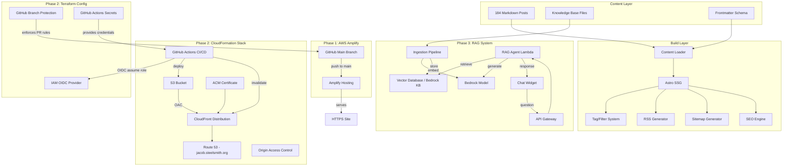
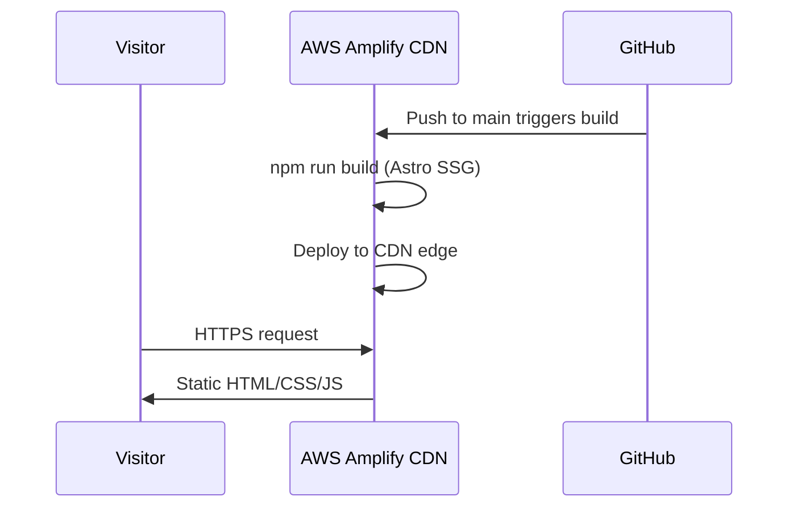
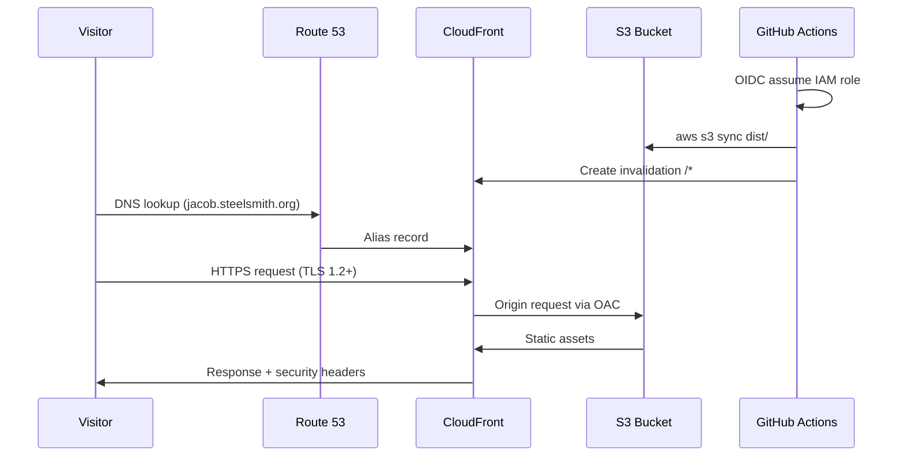
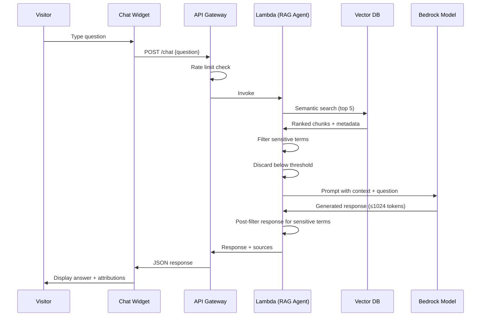

# Design Document

## Overview

This design covers a three-phase project to build a professional portfolio site with a technical blog, AWS infrastructure showcase, and AI-powered career assistant.

**Phase 1 — Astro Blog on AWS Amplify**: Convert 184 existing Markdown posts (2006–2012) into a statically generated Astro site deployed via AWS Amplify. The goal is to get the site live quickly with minimal infrastructure overhead.

**Phase 2 — CloudFormation Infrastructure & CI/CD**: Replace Amplify with a production-grade AWS stack (S3 + CloudFront + Route 53 + ACM + OAC) defined in CloudFormation. Add a GitHub Actions CI/CD pipeline using OIDC for keyless deployments. Build a mandatory Architecture page showcasing the infrastructure.

**Phase 3 — RAG Chat Agent**: Add a conversational AI agent powered by Amazon Bedrock that answers visitor questions about the site owner's career, skills, and projects using Retrieval-Augmented Generation over a curated knowledge base.

### Key Design Decisions

| Decision | Choice | Rationale |
|----------|--------|-----------|
| Static site generator | Astro | Content-first framework with native Markdown support, zero JS by default, excellent build performance |
| Phase 1 hosting | AWS Amplify | Fastest path to production with GitHub integration (`JacobSteelsmith/portfolio`), auto-SSL, custom domains |
| Phase 2 hosting | S3 + CloudFront via CloudFormation | Portfolio-quality IaC, full control, demonstrates AWS expertise |
| IaC strategy | Hybrid: CloudFormation + Terraform | CloudFormation for AWS hosting (S3, CloudFront, ACM, Route 53, OAC); Terraform for cross-platform resources (GitHub config, OIDC provider) that CloudFormation cannot manage |
| CI/CD auth | GitHub OIDC → IAM role | No stored secrets, short-lived credentials, AWS best practice |
| RAG vector store | Amazon Bedrock Knowledge Bases | Managed service, native Bedrock integration, reduces operational burden |
| Chat API | API Gateway + Lambda | Serverless, cost-effective for low-traffic portfolio site |
| Content filtering | Pre-ingestion + pre-response filtering | Defense-in-depth: filter sensitive terms at both pipeline and response stages |

## Architecture

### High-Level System Diagram



### Phase 1 Request Flow



### Phase 2 Request Flow



### Phase 3 RAG Flow



## Components and Interfaces

### Phase 1 Components

#### Content Loader (`src/content/config.ts`)

Responsible for reading and validating all Markdown posts.

```typescript
// Astro Content Collections schema
interface PostFrontmatter {
  title: string;           // Required, max 200 chars
  date: Date;              // Required, YYYY-MM-DD
  description?: string;    // Optional, max 320 chars (auto-generated if missing)
  tags?: string[];         // Optional, max 10 items
  draft?: boolean;         // Optional, default false
  canonicalUrl?: string;   // Optional
  slug?: string;           // Optional, lowercase alphanumeric + hyphens
  featured?: boolean;      // Optional, default false
}
```

**Interfaces:**
- Input: `posts/*.md` files
- Output: Typed `CollectionEntry<'posts'>[]` for page generation
- Error handling: Log warning + skip invalid files, never fail the build

#### Tag System (`src/utils/tags.ts`)

```typescript
interface TagSystem {
  // Normalize tag to lowercase for case-insensitive matching
  normalizeTag(tag: string): string;
  
  // Get all unique tags with post counts (excluding drafts in production)
  getAllTags(posts: Post[]): Map<string, number>;
  
  // Get posts for a specific tag
  getPostsByTag(posts: Post[], tag: string): Post[];
}
```

#### Pagination Engine (`src/utils/pagination.ts`)

```typescript
interface PaginationConfig {
  pageSize: number;  // 10
  basePath: string;  // '/blog'
}

interface PaginatedResult<T> {
  items: T[];
  currentPage: number;
  totalPages: number;
  hasNext: boolean;
  hasPrev: boolean;
}
```

#### SEO Engine (`src/components/SEO.astro`)

```typescript
interface SEOProps {
  title: string;
  description: string;
  canonicalUrl?: string;
  ogType: 'article' | 'website';
  ogImage?: string;
  publishedDate?: string;
}
```

#### RSS Generator (`src/pages/rss.xml.ts`)

Uses `@astrojs/rss` package. Produces RSS 2.0 feed at `/rss.xml` with the 20 most recent published posts.

#### Sitemap Generator

Uses `@astrojs/sitemap` integration. Produces `/sitemap.xml` conforming to Sitemaps.org 0.9 schema.

### Phase 2 Components

#### CloudFormation Stack (`infrastructure/template.yaml`)

**Parameters:**
- `DomainName` (String, default: `jacob.steelsmith.org`): Site domain name
- `HostedZoneId` (String): Route 53 hosted zone ID for `steelsmith.org`

**Resources:**
- `SiteBucket` — S3 bucket with BlockPublicAccess enabled
- `CloudFrontOAC` — Origin Access Control
- `BucketPolicy` — Allows CloudFront OAC read access only
- `Certificate` — ACM certificate with DNS validation for `jacob.steelsmith.org`
- `Distribution` — CloudFront distribution with OAC, security headers, TLS 1.2+
- `DNSRecordA` — Route 53 A alias in `steelsmith.org` zone pointing `jacob.steelsmith.org` to CloudFront
- `DNSRecordAAAA` — Route 53 AAAA alias in `steelsmith.org` zone pointing `jacob.steelsmith.org` to CloudFront

**Outputs:**
- `BucketName`
- `DistributionId`
- `DistributionDomainName`

#### GitHub Actions Pipeline (`.github/workflows/deploy.yml`)

```yaml
# Workflow triggers
on:
  push:
    branches: [main]
  pull_request:
    branches: [main]

# Key steps:
# 1. Checkout code
# 2. Setup Node.js
# 3. Install dependencies
# 4. Build Astro site
# 5. Configure AWS credentials (OIDC)
# 6. Deploy to S3 (environment-specific bucket)
# 7. Invalidate CloudFront cache
```

**OIDC IAM Role Policy:**
```json
{
  "Effect": "Allow",
  "Action": [
    "s3:PutObject",
    "s3:DeleteObject",
    "s3:ListBucket"
  ],
  "Resource": [
    "arn:aws:s3:::${BucketName}",
    "arn:aws:s3:::${BucketName}/*"
  ]
},
{
  "Effect": "Allow",
  "Action": "cloudfront:CreateInvalidation",
  "Resource": "arn:aws:cloudfront::${AccountId}:distribution/${DistributionId}"
}
```

#### Architecture Page (`src/pages/architecture.astro`)

Static page sourced from `src/content/pages/architecture.md` containing:
- Infrastructure component sections (S3, CloudFront, Route 53, ACM, OAC)
- Visual architecture diagram (Mermaid rendered at build time)
- CI/CD pipeline documentation
- At least 3 design decisions with alternatives and rationale

#### Terraform Configuration (`infrastructure/terraform/`)

Manages cross-platform resources that CloudFormation cannot handle, plus the AWS IAM OIDC provider where Terraform modules are more mature.

**Rationale:** CloudFormation cannot manage GitHub resources (branch protection, Actions secrets). The `terraform-aws-oidc-github` module provides a well-tested, community-maintained OIDC provider setup that is more ergonomic than raw CloudFormation custom resources.

**State Backend:**
- S3 bucket for state file storage
- DynamoDB table for state locking

**Resources:**

| Resource | Provider | Purpose |
|----------|----------|---------|
| `aws_iam_openid_connect_provider` | `terraform-aws-oidc-github` module | IAM OIDC identity provider for GitHub Actions |
| `aws_iam_role` | AWS | IAM role assumable by GitHub Actions via OIDC |
| `github_branch_protection` | GitHub | Main branch protection: require PR review + passing CI |
| `github_actions_environment_secret` | GitHub | AWS account ID, role ARN |
| `github_actions_environment_variable` | GitHub | S3 bucket name, CloudFront distribution ID |

**Outputs:**
- `oidc_role_arn` — IAM role ARN consumed by the GitHub Actions deploy workflow

**Interface with CloudFormation:**
```
┌─────────────────────────────┐       ┌──────────────────────────────────┐
│  Terraform                  │       │  CloudFormation                  │
│                             │       │                                  │
│  IAM OIDC Provider ─────────┼──→    │  (referenced by GHA workflow)    │
│  IAM Role (OIDC)            │       │                                  │
│  GitHub Branch Protection   │       │  S3 Bucket ◄──────────────────┐  │
│  GitHub Actions Secrets ────┼──→    │  CloudFront Distribution      │  │
│    - AWS_ACCOUNT_ID         │       │  ACM Certificate              │  │
│    - OIDC_ROLE_ARN          │       │  Route 53 (jacob.steelsmith.org) │
│  GitHub Actions Variables ──┼──→    │  OAC Policy                   │  │
│    - S3_BUCKET_NAME         │       │                                  │
│    - CLOUDFRONT_DIST_ID     │       │                                  │
└─────────────────────────────┘       └──────────────────────────────────┘
```

**Terraform interface:**
```hcl
# infrastructure/terraform/outputs.tf
output "oidc_role_arn" {
  description = "IAM role ARN for GitHub Actions OIDC authentication"
  value       = module.oidc_github.iam_role_arn
}

# infrastructure/terraform/variables.tf
variable "github_repository" {
  description = "GitHub repository in format owner/repo"
  type        = string
  default     = "JacobSteelsmith/portfolio"
}

variable "s3_bucket_name" {
  description = "S3 bucket name from CloudFormation stack output"
  type        = string
}

variable "cloudfront_distribution_id" {
  description = "CloudFront distribution ID from CloudFormation stack output"
  type        = string
}

variable "aws_account_id" {
  description = "AWS account ID for OIDC trust policy"
  type        = string
}
```

### Phase 3 Components

#### Knowledge Base (`knowledge-base/`)

Directory structure:
```
knowledge-base/
├── skills/
│   ├── aws.md
│   ├── programming-languages.md
│   └── frameworks.md
├── experience/
│   ├── current-role.md
│   └── previous-roles.md
├── projects/
│   ├── this-portfolio.md
│   └── other-projects.md
├── certifications/
│   └── aws-certifications.md
└── code-samples/
    ├── python-example.py
    ├── typescript-example.ts
    └── cloudformation-example.yaml
```

Each file includes metadata header:
```yaml
---
source_type: skills | experience | projects | certifications | code-sample
category: aws | programming | leadership | architecture
language: python | typescript | yaml  # for code samples only
project: portfolio-site  # associated project
---
```

#### Ingestion Pipeline (`infrastructure/ingestion/`)

```typescript
interface IngestionConfig {
  chunkSize: { min: 500, max: 1000 };  // tokens
  chunkOverlap: { min: 50, max: 100 }; // tokens
  embeddingModel: string;               // Bedrock embedding model ID
  knowledgeBaseId: string;              // Bedrock Knowledge Base ID
  filteredTerms: string[];              // ["National Testing Network", "NTN", "Ergometrics"]
}

interface ChunkMetadata {
  sourceFile: string;
  sourceType: string;
  category: string;
  language?: string;
  project?: string;
  chunkIndex: number;
}

interface IngestionReport {
  filesProcessed: number;
  chunksGenerated: number;
  embeddingsStored: number;
  filesSkipped: number;
  skippedReasons: Array<{ file: string; reason: string }>;
}
```

**Content Filter (pre-ingestion):**
```typescript
const FILTERED_TERMS = [
  "National Testing Network",
  "NTN",
  "Ergometrics"
];

// Also filters any chunk containing patterns matching encryption keys
const ENCRYPTION_KEY_PATTERN = /-----BEGIN [A-Z]+ KEY-----|[A-Fa-f0-9]{64,}/;

function shouldExcludeChunk(text: string): boolean {
  return FILTERED_TERMS.some(term => 
    text.toLowerCase().includes(term.toLowerCase())
  ) || ENCRYPTION_KEY_PATTERN.test(text);
}
```

#### RAG Agent Lambda (`infrastructure/lambda/rag-agent/`)

```typescript
interface ChatRequest {
  question: string;  // max 500 characters
}

interface ChatResponse {
  answer: string;
  sources: Array<{
    title: string;
    sourceType: string;
  }>;
  error?: string;
}

interface RAGAgentConfig {
  knowledgeBaseId: string;
  modelId: string;              // Bedrock model ID
  maxTokens: number;            // 1024
  relevanceThreshold: number;   // minimum similarity score
  topK: number;                 // 5 chunks to retrieve
  filteredTerms: string[];      // terms to filter from responses
}
```

**Response filter (post-generation):**
```typescript
function filterResponse(response: string): string {
  let filtered = response;
  for (const term of FILTERED_TERMS) {
    const regex = new RegExp(term, 'gi');
    filtered = filtered.replace(regex, '[REDACTED]');
  }
  // If response still contains filtered terms after replacement, 
  // return a safe fallback
  if (containsFilteredTerms(filtered)) {
    return "I don't have information to answer that question.";
  }
  return filtered;
}
```

#### API Gateway + Rate Limiting

- Endpoint: `POST /chat`
- Global rate limit: 100 requests/minute
- Per-IP rate limit: 10 requests/minute (via usage plan or WAF)
- Request validation: question ≤ 500 characters
- Response: JSON `ChatResponse`

#### Chat Widget (`src/components/ChatWidget.astro` + client-side JS)

```typescript
interface ChatWidgetState {
  isOpen: boolean;
  messages: ChatMessage[];
  isLoading: boolean;
  error: string | null;
}

interface ChatMessage {
  role: 'user' | 'assistant';
  content: string;
  sources?: Array<{ title: string; sourceType: string }>;
  timestamp: number;
}
```

- Renders as collapsible overlay with persistent trigger button
- Stores conversation in `sessionStorage` for cross-page persistence
- 30-second timeout with retry capability
- Accessible: keyboard operable, touch targets ≥ 44x44px

## Data Models

### Post Collection Schema (Astro Content Collections)

```typescript
import { z, defineCollection } from 'astro:content';

const postsCollection = defineCollection({
  type: 'content',
  schema: z.object({
    title: z.string().max(200),
    date: z.date(),
    description: z.string().max(320).optional(),
    tags: z.array(z.string()).max(10).default([]),
    draft: z.boolean().default(false),
    canonicalUrl: z.string().url().optional(),
    slug: z.string().regex(/^[a-z0-9-]+$/).optional(),
    featured: z.boolean().default(false),
  }),
});
```

### Filename Parsing

```
Input:  "2006-03-20-immortal-software.md"
Output: { date: "2006-03-20", slug: "immortal-software" }

Pattern: /^(\d{4}-\d{2}-\d{2})-(.+)\.md$/
```

### CloudFormation Stack Parameters

```yaml
Parameters:
  DomainName:
    Type: String
    Default: jacob.steelsmith.org
    Description: Custom domain name for the site
  HostedZoneId:
    Type: String
    Description: Route 53 Hosted Zone ID for steelsmith.org
  Environment:
    Type: String
    AllowedValues: [production, preview]
    Default: production
```

### Vector Database Schema (Bedrock Knowledge Base)

Each stored embedding record:
```json
{
  "id": "uuid",
  "embedding": [0.123, -0.456, ...],  // 1536-dimensional vector
  "metadata": {
    "sourceFile": "knowledge-base/skills/aws.md",
    "sourceType": "skills",
    "category": "aws",
    "language": null,
    "project": null,
    "chunkIndex": 0,
    "chunkText": "Original text content of the chunk..."
  }
}
```

### API Gateway Request/Response

**Request:**
```json
POST /chat
Content-Type: application/json

{
  "question": "What AWS services has the site owner worked with?"
}
```

**Response (success):**
```json
{
  "answer": "Based on the portfolio, the site owner has extensive experience with...",
  "sources": [
    { "title": "AWS Skills", "sourceType": "skills" },
    { "title": "Portfolio Architecture", "sourceType": "projects" }
  ]
}
```

**Response (no relevant context):**
```json
{
  "answer": "I don't have enough information to answer that question.",
  "sources": []
}
```

**Response (rate limited):**
```json
HTTP 429
{
  "error": "Too many requests. Please wait a moment before trying again."
}
```

**Response (input too long):**
```json
HTTP 400
{
  "error": "Question exceeds the maximum length of 500 characters."
}
```

## Correctness Properties

*A property is a characteristic or behavior that should hold true across all valid executions of a system — essentially, a formal statement about what the system should do. Properties serve as the bridge between human-readable specifications and machine-verifiable correctness guarantees.*

### Property 1: Filename parsing extracts date and slug correctly

*For any* filename matching the pattern `YYYY-MM-DD-slug.md`, the Content Loader SHALL extract the date from the first 10 characters and derive the slug from the remaining segment after the date prefix and hyphen separator, excluding the `.md` extension.

**Validates: Requirements 1.2, 2.4**

### Property 2: Frontmatter values take precedence over filename-derived values

*For any* Markdown file that contains both frontmatter fields (title, date, description, tags, slug) and a filename matching the naming convention, the Content Loader SHALL use the frontmatter values, and the filename-derived values SHALL be ignored.

**Validates: Requirements 1.3, 1.4**

### Property 3: Invalid frontmatter causes skip without build failure

*For any* Markdown file with invalid YAML frontmatter or missing the required `title` field, the Content Loader SHALL skip the file and the build SHALL complete successfully with all other valid files processed.

**Validates: Requirements 1.5, 1.6**

### Property 4: Frontmatter schema validation

*For any* frontmatter object, the schema SHALL accept it if and only if: title is a string ≤ 200 characters, date is a valid YYYY-MM-DD date, description (if present) is ≤ 320 characters, tags (if present) is an array of ≤ 10 strings, draft (if present) is boolean, and slug (if present) matches `^[a-z0-9-]+$`.

**Validates: Requirements 2.1**

### Property 5: Auto-generated description from post body

*For any* post body text, when the description field is absent, the generated description SHALL be plain text (no markdown syntax), truncated to at most 160 characters at the last word boundary, and SHALL equal the full plain text body when the body is shorter than 160 characters.

**Validates: Requirements 2.2, 2.3**

### Property 6: Draft posts excluded from all production outputs

*For any* set of posts where some have `draft: true`, the production build output SHALL exclude all draft posts from: individual post pages, blog listing pages, tag listing pages, pagination counts, RSS feed, and sitemap. Furthermore, any tag that has zero published posts after draft exclusion SHALL not have a generated tag page or appear in the tags index.

**Validates: Requirements 4.1, 4.3, 4.4, 7.5, 8.4, 9.3**

### Property 7: Blog listing sort order

*For any* set of published posts, the blog listing pages SHALL display posts in reverse chronological order by date, with ties broken by filename in reverse alphabetical order.

**Validates: Requirements 3.3, 6.2**

### Property 8: Pagination correctness

*For any* set of N published posts, the Pagination Engine SHALL produce ⌈N/10⌉ pages where each page (except possibly the last) contains exactly 10 posts, the first page is at `/blog/`, and subsequent pages are at `/blog/{n}/` for n = 2, 3, ..., and navigation links correctly indicate next/previous availability.

**Validates: Requirements 6.1, 6.3, 6.5**

### Property 9: Tag normalization and indexing

*For any* set of tags across all posts, the Tag System SHALL normalize tags case-insensitively (so "JavaScript" and "javascript" resolve to the same tag), generate one listing page per unique normalized tag, and produce a tags index page listing all tags alphabetically with correct published post counts.

**Validates: Requirements 7.1, 7.2, 7.3**

### Property 10: Homepage post selection

*For any* set of published posts, the homepage SHALL display the min(5, total_published) most recent posts in reverse chronological order. When one or more posts have `featured: true`, a featured section SHALL appear showing up to 5 featured posts. When no posts have `featured: true`, the featured section SHALL be absent.

**Validates: Requirements 5.2, 5.4, 5.5, 5.6**

### Property 11: RSS feed completeness and ordering

*For any* set of published posts, the RSS feed SHALL contain at most 20 entries sorted by publication date descending, and each entry SHALL include the post title, publication date, description, and an absolute URL link to the full post.

**Validates: Requirements 8.2, 8.3**

### Property 12: Sitemap integrity

*For any* successful build, the sitemap SHALL contain exactly one URL entry per published page (posts, paginated listings, tag pages, and static pages), with no duplicate URLs, and each entry SHALL include a valid `<lastmod>` date.

**Validates: Requirements 9.2, 9.4, 9.5**

### Property 13: SEO metadata completeness

*For any* generated page, the SEO Engine SHALL render: a unique `<title>` tag, a `<meta name="description">` tag truncated to ≤ 160 characters, Open Graph tags (og:title, og:description, og:type, og:url) with og:type "article" for posts and "website" otherwise, Twitter Card tags, and a canonical URL link tag. When a post specifies `canonicalUrl` in frontmatter, that value SHALL be used as the canonical URL.

**Validates: Requirements 10.1, 10.2, 10.3, 10.4, 10.5, 10.6**

### Property 14: Heading level hierarchy

*For any* generated HTML page, heading elements SHALL not skip levels (e.g., an h1 SHALL not be followed by an h3 without an intervening h2).

**Validates: Requirements 17.3**

### Property 15: Content chunking within bounds

*For any* Knowledge Base text content processed by the Ingestion Pipeline, each generated chunk SHALL be between 500 and 1000 tokens in length, and consecutive chunks from the same source SHALL overlap by 50 to 100 tokens.

**Validates: Requirements 20.1**

### Property 16: Sensitive content filtering (defense-in-depth)

*For any* content chunk containing "National Testing Network", "NTN", "Ergometrics", or encryption key patterns, the Ingestion Pipeline SHALL exclude that chunk from the Vector Database. Additionally, *for any* RAG Agent response, the response text SHALL never contain these filtered terms — if detected post-generation, the response SHALL be sanitized or replaced with a fallback message.

**Validates: Requirements 20.10, 21.8**

### Property 17: Retrieval threshold enforcement

*For any* visitor question, the RAG Agent SHALL use only chunks with similarity scores at or above the configured relevance threshold (discarding the rest), retrieve at most 5 chunks, and when all retrieved chunks fall below the threshold, SHALL return the "no information" fallback message.

**Validates: Requirements 21.1, 21.4**

### Property 18: Source attribution in responses

*For any* successful RAG Agent response (where relevant context was found), the response SHALL include at least one source attribution identifying the origin content by title, project name, or skill area.

**Validates: Requirements 21.3**

### Property 19: Chat input length validation

*For any* input string exceeding 500 characters submitted to the Chat Widget or API, the system SHALL reject the input and return an error response indicating the question is too long, without invoking the RAG Agent.

**Validates: Requirements 22.2, 23.6**

### Property 20: Chat session persistence

*For any* sequence of chat messages stored during a browser session, navigating to a different page on the site and returning SHALL preserve the full conversation history in chronological order.

**Validates: Requirements 22.7**

## Error Handling

### Phase 1: Content Loading Errors

| Error Condition | Handling Strategy |
|----------------|-------------------|
| Invalid YAML frontmatter | Log warning with filename, skip file, continue build |
| Missing required `title` field | Log warning with filename, skip file, continue build |
| Filename doesn't match pattern + no date in frontmatter | Log warning, skip file, continue build |
| Empty Markdown file | Log warning, skip file, continue build |
| Build failure | Amplify retains previous deployment |

### Phase 2: Infrastructure & CI/CD Errors

| Error Condition | Handling Strategy |
|----------------|-------------------|
| CloudFormation stack creation failure | Automatic rollback to previous state |
| OIDC role assumption failure | Pipeline fails, reports via GitHub Actions status |
| S3 sync failure | Pipeline halts, no CloudFront invalidation triggered |
| CloudFront invalidation failure | Pipeline reports failure (site still serves stale content) |
| ACM certificate validation timeout | Stack creation fails, manual DNS verification needed |

### Phase 3: RAG System Errors

| Error Condition | Handling Strategy |
|----------------|-------------------|
| Bedrock embedding API failure | Log error with source file ID, skip file, continue processing |
| Empty/unparseable KB source file | Log error, skip file, continue processing |
| Bedrock model unavailable | Return "service temporarily unavailable" message to Chat Widget |
| All chunks below relevance threshold | Return "I don't have information to answer that" message |
| API Gateway rate limit exceeded | Return HTTP 429 with retry guidance |
| Question exceeds 500 characters | Return HTTP 400 with length error message |
| Chat Widget 30-second timeout | Display error message, enable retry button |
| Ingestion pipeline partial failure | Complete run, report skipped files in summary |

### Error Response Consistency

All API error responses follow a consistent JSON structure:
```json
{
  "error": "Human-readable error message",
  "code": "MACHINE_READABLE_CODE"
}
```

Error codes:
- `RATE_LIMITED` — HTTP 429
- `INPUT_TOO_LONG` — HTTP 400
- `SERVICE_UNAVAILABLE` — HTTP 503
- `NO_RELEVANT_CONTEXT` — HTTP 200 (not an error, but a valid "I don't know" response)

## Testing Strategy

### Dual Testing Approach

This project uses both unit/example-based tests and property-based tests for comprehensive coverage.

**Property-Based Testing Library:** [fast-check](https://github.com/dubzzz/fast-check) (TypeScript)

Property-based tests are appropriate for this project because:
- Content loading involves parsing logic with a large input space (filenames, frontmatter, markdown bodies)
- Tag normalization, pagination, and sorting are pure functions with universal properties
- Content filtering is a critical security function that must hold for all inputs
- The RAG retrieval logic has clear threshold-based invariants

### Property-Based Tests (minimum 100 iterations each)

Each property test references its design document property:

| Property | Test Focus | Tag |
|----------|-----------|-----|
| 1 | Filename parsing | `Feature: astro-blog-aws-portfolio, Property 1: Filename parsing extracts date and slug correctly` |
| 2 | Frontmatter precedence | `Feature: astro-blog-aws-portfolio, Property 2: Frontmatter values take precedence` |
| 3 | Invalid frontmatter handling | `Feature: astro-blog-aws-portfolio, Property 3: Invalid frontmatter causes skip` |
| 4 | Schema validation | `Feature: astro-blog-aws-portfolio, Property 4: Frontmatter schema validation` |
| 5 | Description generation | `Feature: astro-blog-aws-portfolio, Property 5: Auto-generated description` |
| 6 | Draft filtering | `Feature: astro-blog-aws-portfolio, Property 6: Draft posts excluded from production` |
| 7 | Sort order | `Feature: astro-blog-aws-portfolio, Property 7: Blog listing sort order` |
| 8 | Pagination | `Feature: astro-blog-aws-portfolio, Property 8: Pagination correctness` |
| 9 | Tag normalization | `Feature: astro-blog-aws-portfolio, Property 9: Tag normalization and indexing` |
| 10 | Homepage selection | `Feature: astro-blog-aws-portfolio, Property 10: Homepage post selection` |
| 11 | RSS feed | `Feature: astro-blog-aws-portfolio, Property 11: RSS feed completeness` |
| 12 | Sitemap | `Feature: astro-blog-aws-portfolio, Property 12: Sitemap integrity` |
| 13 | SEO metadata | `Feature: astro-blog-aws-portfolio, Property 13: SEO metadata completeness` |
| 14 | Heading hierarchy | `Feature: astro-blog-aws-portfolio, Property 14: Heading level hierarchy` |
| 15 | Chunking | `Feature: astro-blog-aws-portfolio, Property 15: Content chunking within bounds` |
| 16 | Sensitive filtering | `Feature: astro-blog-aws-portfolio, Property 16: Sensitive content filtering` |
| 17 | Retrieval threshold | `Feature: astro-blog-aws-portfolio, Property 17: Retrieval threshold enforcement` |
| 18 | Source attribution | `Feature: astro-blog-aws-portfolio, Property 18: Source attribution in responses` |
| 19 | Input validation | `Feature: astro-blog-aws-portfolio, Property 19: Chat input length validation` |
| 20 | Session persistence | `Feature: astro-blog-aws-portfolio, Property 20: Chat session persistence` |

### Unit/Example-Based Tests

| Area | Tests |
|------|-------|
| Content defaults | Verify missing tags → empty array, missing draft → false |
| Static pages | Verify About, Resume, Contact, Architecture pages render with expected sections |
| RSS channel metadata | Verify feed contains site title, description, URL |
| RSS autodiscovery | Verify `<link>` tag present in HTML head |
| Navigation | Verify Architecture page appears in main nav |
| Design decisions | Verify Architecture page contains ≥ 3 decision sections |
| Syntax highlighting | Verify code blocks render with highlight classes |
| Error responses | Verify Bedrock failure returns correct error message |
| Rate limiting | Verify 429 response format |

### Integration Tests

| Area | Tests |
|------|-------|
| Full build | Build site with all 184 posts, verify output completeness |
| Lighthouse CI | Performance ≥ 90, Accessibility ≥ 90 on key pages |
| CloudFormation validation | `aws cloudformation validate-template` passes |
| Link checking | All internal links resolve within build output |
| Responsive layout | Visual regression at 320px, 768px, 1200px, 2560px |
| RAG end-to-end | Question → retrieval → response with real Bedrock (limited runs) |
| Deployment | S3 sync + CloudFront invalidation completes successfully |

### Smoke Tests

| Area | Tests |
|------|-------|
| Amplify HTTPS | Site serves over HTTPS with valid certificate |
| S3 public access blocked | Verify direct S3 access is denied |
| OIDC authentication | GitHub Actions can assume the IAM role |
| CloudFormation outputs | Stack exports bucket name, distribution ID, domain |
| Knowledge Base structure | Directory structure matches specification |
| API Gateway throttle | Rate limit configuration is set correctly |

### Test Execution

- **Local development:** `npm test` runs unit + property tests via Vitest + fast-check
- **CI pipeline:** Full test suite including integration tests
- **Property tests:** Configured for 100 iterations minimum in CI, 10 in local dev for speed
- **Lighthouse:** Run via `@lhci/cli` in CI after deployment to preview environment

