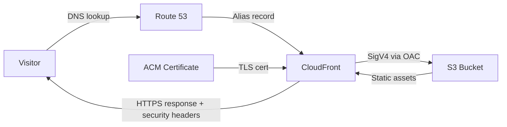
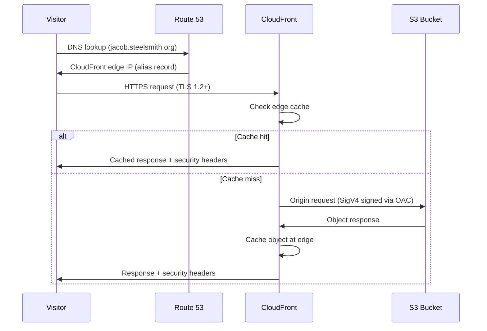
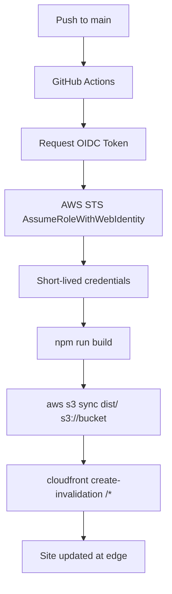

# Site Architecture

This page documents the infrastructure behind jacob.steelsmith.org. Every component is defined as code, version-controlled, and deployed through automated pipelines. The stack is intentionally simple — static hosting done right with AWS primitives rather than managed platforms.

## Infrastructure Components

### Amazon S3 — Origin Storage

The S3 bucket stores the built static site assets (HTML, CSS, JS). All public access is blocked at the bucket level via S3 Block Public Access. The bucket is never accessed directly by visitors — CloudFront is the only reader, enforced through a bucket policy that checks the CloudFront distribution ARN.

**Why S3?** It's the most cost-effective, durable (11 nines) object store available. For a static site with no server-side logic, S3 is the natural origin. There's no compute to manage, no patching, and no scaling configuration.

### Amazon CloudFront — CDN and Edge Delivery

CloudFront sits in front of S3 and serves content from edge locations worldwide. It handles TLS termination, HTTP/2 and HTTP/3, Brotli/gzip compression, and caching. The distribution enforces HTTPS-only access with a minimum TLS version of 1.2 (TLSv1.2_2021 policy).

Security headers are applied via a CloudFront Response Headers Policy:
- `Strict-Transport-Security`: max-age 2 years, includeSubDomains, preload
- `X-Content-Type-Options`: nosniff
- `X-Frame-Options`: DENY
- `Content-Security-Policy`: restricts resource loading to same-origin by default

**Why CloudFront?** It provides global edge caching, automatic compression, and security header injection without running a web server. The CachingOptimized managed policy handles cache keys intelligently.

### Route 53 — DNS Resolution

Route 53 hosts the `steelsmith.org` zone and provides alias records (both A and AAAA for IPv4/IPv6) pointing `jacob.steelsmith.org` to the CloudFront distribution. Alias records are free, have no TTL limitations, and respond with the CloudFront edge IP closest to the resolver.

**Why Route 53?** Native integration with CloudFront alias records eliminates CNAME flattening hacks. Health checks and failover routing are available if needed later.

### AWS Certificate Manager (ACM) — TLS Certificate

ACM provisions and auto-renews the TLS certificate for `jacob.steelsmith.org`. The certificate uses DNS validation via a CNAME record in the Route 53 hosted zone, which means renewal is fully automatic with zero manual intervention.

**Why ACM?** Free certificates with automatic renewal. DNS validation means no email or HTTP challenge infrastructure. The certificate must live in us-east-1 for CloudFront, which the CloudFormation template enforces.

### Origin Access Control (OAC) — S3 Access Restriction

OAC replaces the legacy Origin Access Identity (OAI) mechanism. It uses SigV4 request signing so that CloudFront authenticates to S3 on every origin request. The S3 bucket policy only allows `s3:GetObject` when the request comes from the specific CloudFront distribution ARN.

**Why OAC over OAI?** OAC supports all S3 features (SSE-KMS, S3 Object Lambda), uses standard IAM policy conditions, and is the AWS-recommended approach going forward. OAI is legacy and doesn't support newer S3 capabilities.

## Request Flow

The following diagram shows how a visitor's request travels through the infrastructure:

### Detailed Request Sequence

## CI/CD Pipeline

The deployment pipeline runs on GitHub Actions and uses OIDC for credential-free AWS authentication.

### Pipeline Steps

1. **Build Trigger**: A push to the `main` branch triggers the workflow
2. **OIDC Authentication**: The workflow assumes an IAM role via GitHub's OIDC provider — no stored AWS access keys
3. **Site Build**: Astro builds the static site (`npm run build`)
4. **S3 Deployment**: Built assets are synced to the S3 bucket (`aws s3 sync`)
5. **CloudFront Invalidation**: A wildcard invalidation (`/*`) clears all cached content at edge locations

### CI/CD Flow Diagram

### IAM Permissions

The deploy role follows least-privilege principles:
- `s3:PutObject`, `s3:DeleteObject`, `s3:ListBucket` — scoped to the specific site bucket
- `cloudfront:CreateInvalidation` — scoped to the specific distribution

No admin access, no wildcard resources, no long-lived credentials.

## Infrastructure as Code

The project uses a hybrid IaC approach:

| Tool | Scope |
|------|-------|
| **CloudFormation** | AWS hosting infrastructure (S3, CloudFront, ACM, Route 53, OAC, security headers) |
| **Terraform** | Cross-platform resources (GitHub branch protection, Actions secrets/variables, IAM OIDC provider) |

Both templates are version-controlled in the `infrastructure/` directory and can recreate the entire stack from scratch.

## Design Decisions

### 1. S3 + CloudFront over AWS Amplify Hosting

**Choice:** Migrate from Amplify Hosting to S3 + CloudFront for production.

**Alternatives considered:**
- **AWS Amplify Hosting** — managed build/deploy with less configuration
- **AWS App Runner** — container-based hosting
- **Vercel/Netlify** — third-party static hosting platforms

**Rationale:** Amplify abstracts away the infrastructure, which is the opposite of what a portfolio site should demonstrate. S3 + CloudFront gives full control over caching behavior, security headers, error handling, and origin access patterns. It also demonstrates real-world AWS architecture skills that hiring managers evaluate. The cost is comparable (often lower) and the configuration is fully documented in CloudFormation.

### 2. OIDC Authentication over Stored IAM Credentials

**Choice:** Use GitHub Actions OIDC provider to assume an IAM role instead of storing AWS access keys as repository secrets.

**Alternatives considered:**
- **Long-lived IAM access keys** stored as GitHub Actions secrets
- **AWS CodePipeline** with native IAM integration

**Rationale:** OIDC eliminates credential rotation burden and reduces blast radius. Tokens are short-lived (valid for one workflow run), scoped to the specific repository and branch, and auditable in CloudTrail. Stored access keys are a security liability — they don't expire, can be exfiltrated, and require manual rotation. The `unfunco/oidc-github` Terraform module makes setup straightforward.

### 3. CloudFormation + Terraform Hybrid over Pure Terraform

**Choice:** Use CloudFormation for AWS infrastructure and Terraform for cross-platform resources (GitHub settings, OIDC provider).

**Alternatives considered:**
- **Pure Terraform** for everything
- **Pure CloudFormation** for everything
- **AWS CDK** for infrastructure

**Rationale:** CloudFormation has first-class support for AWS resources with zero provider lag — new features are available immediately. Terraform excels at managing resources across providers (AWS + GitHub in one plan). Using both plays to each tool's strengths: CloudFormation for the hosting stack where AWS-native features matter, Terraform for the GitHub integration where the `github` provider is mature and well-tested. This also demonstrates proficiency with both tools, which is relevant for platform engineering roles.

### 4. Static Site Generation over Server-Side Rendering

**Choice:** Generate all pages at build time with Astro's static output mode.

**Alternatives considered:**
- **Server-side rendering (SSR)** with Astro or Next.js on Lambda@Edge
- **Incremental Static Regeneration (ISR)** with Next.js
- **Client-side rendering (CSR)** with a SPA framework

**Rationale:** A blog with 184 posts that change infrequently is the ideal use case for static generation. There's no per-request compute cost, no cold starts, no runtime errors, and pages are served directly from CDN cache. The entire site builds in seconds. SSR adds complexity and cost with no benefit for content that doesn't change between requests.
